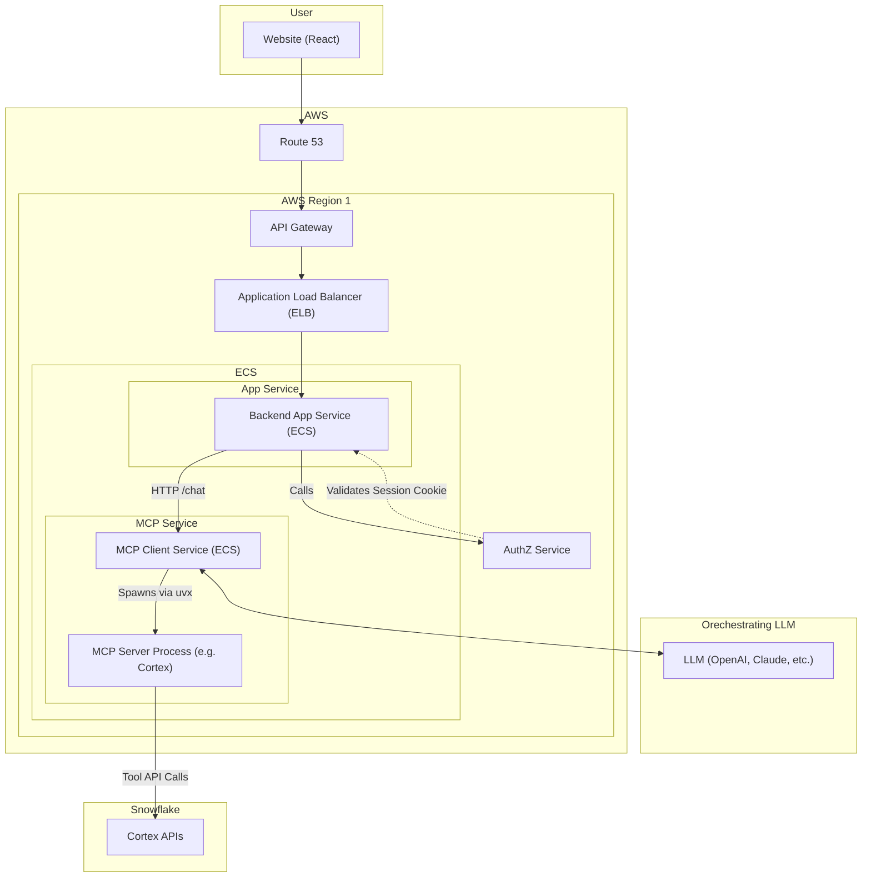

# 🧠 AI-Powered Enterprise Chat App with Snowflake Cortex + FastAgent

This repository contains a production-grade architecture for deploying a secure, scalable AI assistant built on Snowflake Cortex, FastAgent, and the Model Context Protocol (MCP). The backend is split into two services:

* `api/`: Your enterprise-facing FastAPI service (main API)
* `mcp/`: A FastAPI-based MCP client powered by FastAgent
* `frontend/`: React-based frontend for user interaction

The system is fully containerized for ECS deployment and includes support for:

* Cookie-based enterprise SSO authentication
* Tool orchestration via Cortex MCP server
* Modular, role-aware agent configurations
* Optional workflows, memory, and logging

---

## 📁 Directory Overview

| Path                | Description                                                         |
|---------------------|---------------------------------------------------------------------|
| `api/`              | FastAPI service that handles `/chat` and `/stream`, enforces auth   |
| ├── `main.py`       | Validates session cookie and routes chat messages to the MCP client |
| ├── `Dockerfile`    | Build/runtime Python dependencies for API                           |
| ├── `requirements.txt` | Python dependencies for API                                    |
| `mcp/`              | FastAgent client that launches and interacts with MCP servers       |
| ├── `client.py`     | Defines `/agent` and `/agent/sse` endpoints, starts FastAgent       |
| ├── `fastagent.config.yaml` | Agent tools, memory, roles, logging config (FastAgent only) |
| ├── `Dockerfile`    | Containerizes FastAgent and MCP dependencies                        |
| ├── `requirements.txt` | Python dependencies for MCP client                             |
| └── `servers/`      | MCP server definitions (used by MCP server only)                    |
| ├── `cortex.yaml`   | Defines Cortex Search + Analyst services                            |
| `frontend/`         | React frontend for user interaction                                 |
| ├── `src/`          | React source code                                                   |
| ├── `Dockerfile`    | Containerizes frontend                                              |
| ├── `package.json`  | Frontend dependencies                                               |
| `docker-compose.yml`| Local development support (runs all services)                       |
| `aws/`              | AWS ECS task and service definitions                                |

---

## ✅ Features

* **Enterprise-grade authentication** using secure session cookies and external auth service validation
* **Split deployment** of app vs AI logic for scalability and isolation
* **Pluggable Cortex tools** via `cortex.yaml`
* **Extendable agent behavior**: tool chaining, memory, audit logging, roles
* **JWT-based inter-service authentication** for secure backend-to-backend calls
* **Environment variable-based secret/config management**

---

## 🚀 Run Locally

```bash
# Build and start services
docker-compose up --build

# Access FastAPI backend:
# http://localhost:8000/docs

# Access MCP client (FastAgent):
# http://localhost:5005/agent

# Access frontend:
# http://localhost:3000/
```

To simulate auth, set a `session` cookie with a JWT signed using your mock public key. For local development, authentication can be bypassed by setting `DISABLE_AUTH_FOR_DEV=1` in the backend-app environment.

---

## 🔐 Auth Flow (Production)

1. User logs in through your enterprise SSO
2. Auth service sets a secure, HttpOnly `session` cookie
3. `api/` validates the JWT using `RS256` and optionally calls the `/validate` authz endpoint
4. If valid, request is passed to `/agent` (in `mcp/`) with user context, using a short-lived JWT for inter-service authentication

---

## 🧠 Agent Orchestration + Server Management

* `fastagent.config.yaml` defines how FastAgent interprets prompts and connects to MCP servers
* `cortex.yaml` defines what the Cortex MCP server can do (Cortex Analyst + Search)
* The MCP server is spun up **at runtime** by FastAgent using `uvx`

---

## 📦 ECS, Observability & Production Notes

* **MCP client and backend run as separate ECS services**
* Secrets (Snowflake PAT, API keys, JWT secrets, public keys, etc.) should be injected via ECS task env vars or AWS Secrets Manager
* Logging from the MCP subprocess is piped to `/var/log/mcp_client.log`
* Service URLs (e.g., `MCP_CLIENT_URL`, `MCP_STREAM_URL`) are set via environment variables for portability
* For production, remove `DISABLE_AUTH_FOR_DEV` and use a real external auth service

---

### 🔍 OpenTelemetry / Observability

The backend app is instrumented for OpenTelemetry-compatible observability.

* ✅ **Basic OTEL Logging** using FastAPI's logging system (stdout, ECS log routing)
* ✅ **Custom Metrics** (chat usage, errors) can be emitted via OTEL-compatible metrics exporters
* 🧪 Use an OTEL collector or agent (e.g. AWS Distro for OpenTelemetry) to forward to CloudWatch, Datadog, Prometheus, or others

Future expansions may include:

* Distributed tracing of chat → MCP server calls
* Prometheus counters for `/chat` volume, success rate, latency buckets

To get started:

* Add `opentelemetry-instrumentation-fastapi`, `opentelemetry-sdk`, `opentelemetry-exporter-otlp`
* Configure an OTEL collector or use the ECS agent to forward metrics/logs

---

## ➕ Adding a New MCP Server

To add a new MCP server (e.g. FinanceBot, HRBot):

1. **Create a new config file** in `mcp/servers/`, e.g. `financeserver.yaml`
2. **Update** `fastagent.config.yaml` with an additional server block:

```yaml
mcp:
  servers:
    finance:
      command: "uvx"
      args:
        - "--from"
        - "git+https://github.com/acme-inc/finance-mcp"
        - "finance-mcp-server"
        - "--service-config-file"
        - "/app/mcp/servers/financeserver.yaml"
```

No changes to `client.py` are needed — FastAgent dynamically handles the server entries.

---

## 📌 To Customize

* Add more tools to `fastagent.config.yaml`
* Add additional Cortex services to `cortex.yaml`
* Swap out `authz-service.internal/validate` for your real authz API
* Connect Redis, S3, or other services for memory/logging
* Update environment variables in `docker-compose.yml` or your deployment system for secrets, service URLs, and config

---

## 🗺️ Architecture Diagram



---

## 🧪 Coming Soon

* Templates for plugin functions (e.g. `send_email`, `create_ticket`)
* Full observability setup (CloudWatch + X-Ray)
* Multi-agent orchestration scenarios

---

For more on FastAgent: [https://fast-agent.ai](https://fast-agent.ai)
For MCP Server: [https://github.com/Snowflake-Labs/mcp](https://github.com/Snowflake-Labs/mcp)
